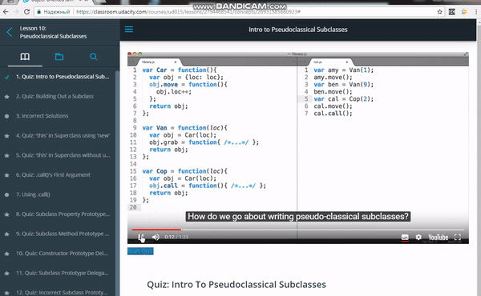

### YT subtitles viewer for Udacity.com

**[Udacity YT subtitles viewer](https://chrome.google.com/webstore/detail/udacity-yt-subtitles-view/phmkmmaonaailokhjpfpcegeonbblgjd?utm_source=chrome-app-launcher-info-dialog)** 
on Chrome extentions page.

Extention for chrome able to views subtitles of current youtube video in Udacity.com. 
It's really useful for learning new technical words and see all the subtitles in one popup sidebar near the video. 
Most efficient with **[Lingualeo addon](https://chrome.google.com/webstore/detail/lingualeo-english-transla/nglbhlefjhcjockellmeclkcijildjhi?hl=ru)**

